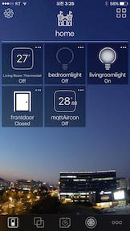
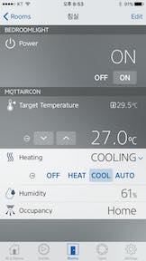
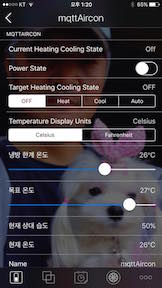

my home iot
===========

# Contents
- [Software](#software)
- [Hardware](#hardware)

## Software
* mosquitto : mqtt broker
* nodered : A visual tool for wiring the Internet of Things
* homebridge : NodeJS server you can run on your home network that emulates the iOS HomeKit API
* homebridge-plugin
* app
 - hesperus : https://itunes.apple.com/kr/app/hesperus/id969348892?l=en&mt=8
 - elgato-eve : https://itunes.apple.com/kr/app/elgato-eve/id917695792?l=en&mt=8

## Hardware
* anything can connect to internet
* esp8266!!
* for remote control : apple tv(with ios 10 : apple tv or ipad)

hesperus    | elgato-eve | hesperus
------------|------------|------------
 |  | 

### mosquitto with tls
 - https://github.com/chaeplin/nest-in-korea/blob/master/SW.md

### install nodered
 - http://nodered.org/docs/getting-started/installation

### install homebridge
 - https://github.com/nfarina/homebridge
 - npm install -g homebridge --unsafe-perm
 - howto : https://github.com/nfarina/homebridge/wiki

### install homebridge-plugin
 - https://www.npmjs.com/search?q=homebridge-plugin

### some homebridge-plugin for mqtt
 - https://github.com/chaeplin/homebridge-mqttlightbulb
 - https://github.com/chaeplin/homebridge-mqttlock
 - https://github.com/chaeplin/homebridge-mqttdoor
 - https://github.com/chaeplin/homebridge-mqtt-temperature
 - https://github.com/chaeplin/homebridge-mqttAircon

### set up esp8266 with mqtt
 - https://github.com/chaeplin/esp8266_and_arduino/tree/master/_72-homekit-accessories-Aircon
 - https://github.com/chaeplin/esp8266_and_arduino/tree/master/_70-homekit-accessories-light
 

